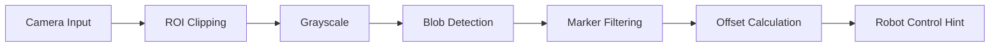

# 🤖 AMR Precision Docking System with OpenCV

AMR(자율 주행 로봇)의 정밀 도킹을 위해 마커 기반의 영상 처리 및 제어 로직을 구현한 프로젝트입니다. 카메라로부터 유입되는 영상에서 노이즈를 배제하고 실시간으로 정렬 오차($dx, dy$)를 산출합니다.

## 🌟 주요 기능 (Key Features)

* **동적 ROI(Region of Interest) 제어**: 화면 전체가 아닌 설정된 관심 영역 내에서만 연산을 수행하여 노이즈 간섭을 최소화하고 처리 속도를 향상시킵니다.
* **실시간 파라미터 튜닝**: OpenCV Trackbar를 통해 원형도(Circularity), 최소 면적(Min Area), ROI 크기를 GUI 환경에서 즉각적으로 조절 가능합니다.
* **정밀 오프셋 산출**: 감지된 두 마커의 중점을 계산하여 화면 중앙으로부터의 거리($dx, dy$)를 픽셀 단위로 제공합니다.
* **데이터 로깅 및 녹화**: `S` 키 입력을 통해 실험 영상을 `.avi` 파일로 저장하여 사후 분석을 지원합니다.
* **시각적 가이드**: HUD(Heads-Up Display) 스타일의 UI를 통해 정렬 상태와 조준점(Crosshair)을 시각화합니다.

## 🛠 기술 스택 (Tech Stack)

* **Language**: Python
* **Library**: OpenCV, NumPy
* **Algorithm**: SimpleBlobDetector 기반의 특징점 추출

## 📈 시스템 파이프라인 (Pipeline)



## 🚀 시작하기 (Getting Started)

### 요구 사항
* Python 3.8 이상
* OpenCV (`opencv-python`)
* NumPy

### 설치 및 실행
```bash
# 레파지토리 클론
git clone https://github.com/your-username/amr-docking-system.git

# 의존성 설치
pip install opencv-python numpy

# 실행
python amr_docking_final.py
```

## 🎮 조작법 (Controls)

* **`S`**: 영상 녹화 시작 및 중지 (동영상 파일 자동 저장)
* **`Q`**: 프로그램 종료
* **Trackbars**: 마우스 드래그로 검출 감도 및 ROI 범위 실시간 조절

---
Developed for **AMR Precision Alignment Research**.